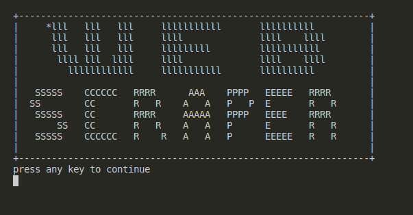
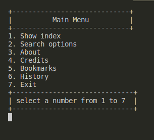
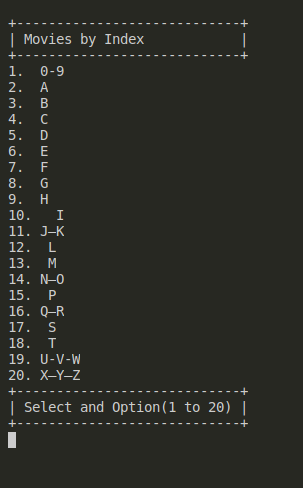
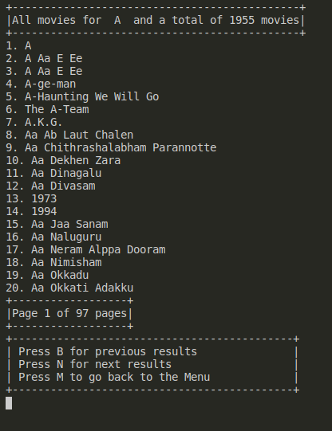
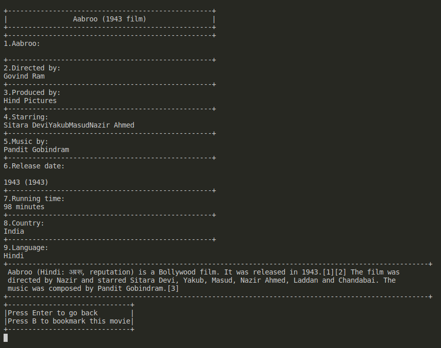
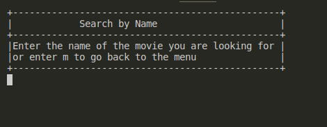
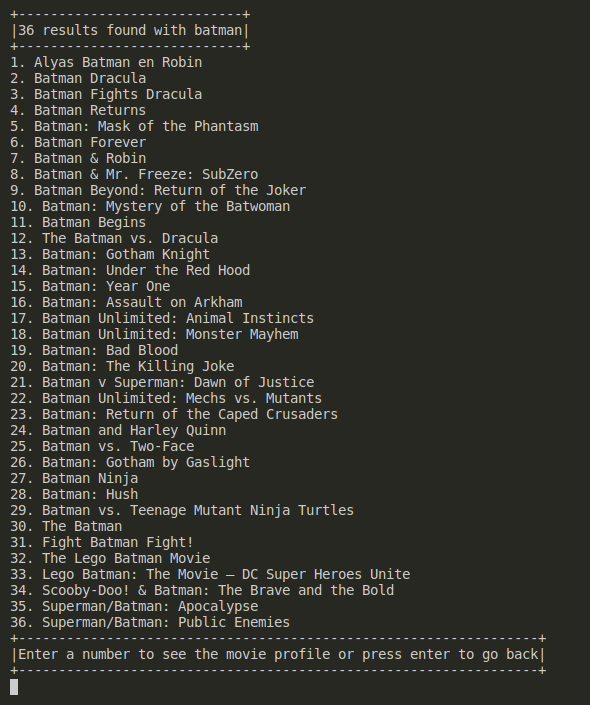
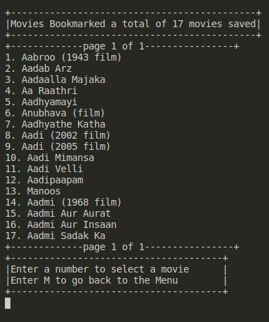
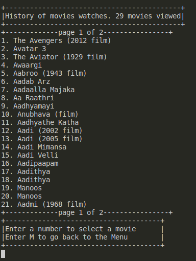

## Ruby's Movies WEB Scraper from Wikipedia

This project is a web scrapper made with ruby, its function is to get all the movies store on Wikipedia.

The project includes:
-Menu that let find the movies by index
-A search option to look out movies by name
-A bookmark option to compare and have a fast way to find movies again.
-A history that lets you find that movie you saw before but you didn't bookmark it.

The project also includes 'type sense' option to avoid invalid inputs or app crashing.
## Built With

- Ruby

## Getting Started

To get a local copy up and running follow these simple example steps.

### Prerequisites

1. VSCode

2. Terminal (Bash)

3. Linter tests

4. Git

5. Ruby

6. nokogiri

7. httparty

8. Rspec
  
### Setup

Setup by  following the installation instructions below :
- Open your terminal and locate the folder you want to clone the repository.

### Install

First you need to clone the repository to a local folder, to do that user the following command on you terminal:

```
$ git clone git@github.com:JAAR91/Web_Scraper_Ruby.git
```
Now get inside your folder using:
```
$ cd WE_SCRAPER_RUBY
```
I use a nokori and httparty gem to help me scrap the website, to install then user the command:
```
$ gem install bundle
```

## How to Start the Scraper

```console
ruby bin/main.RB
```

### Usage

It's simple, once open you find yourself on the welcome page:



Once you press enter you will find the menu screen:



To select the options you need to enter the number that appears next to each option, if choosing 1 this will take you to the index:



Choose any of this option to get a list of movies base on the option selected(Ex. 2):



Now on top you will see the number of movies on this list, also you can see the list by pages do you don't need to scroll to find a movie, and you can change pages using n(next) or b(back), also you can go back to menu by pressing m, then to see the movie profile you need to enter the number next to it(Ex. 19):



Now you can see all the basic details of the movie including brief info about it. To go back just press enter.

When you select the search option on the menu, you first will have to wait a couple of seconds after the program gets all the movies from the page, then it will ask you to enter the name of the movie, like this:



Enter a word(Ex. batman) and this will return all the movies that contain that word on their name:



Now you only have to enter the number of the movie you want to see the info off, just like we saw before if you want to look for another movie just press enter, and it will ask you again to enter a name, to go back to the menu just press m on the search by name screen.

The App also includes a bookmark option you can find on the movie profile, in case you want to compare movies one to another, you save as many as you can and then from the menu you select the option 5, and this will show you the list of bookmarked movies in list of 20 movies per page.



Once on the bookmark menu you can open each movie profile just like before and even remove the movie from the bookmarks.

To end there is also a history option on the menu, that let you see all the movies profile you have visited in case you forgot to bookmark a movie and dont want to search for the movie again, you can find it on the history.



## Authors

👤 **Jose Alberto Arriaga Ramos**

- GitHub: [@jaarkira](https://github.com/jaarkira )
- Twitter: [@91_jaar](https://twitter.com/91_jaar )
- LinkedIn: [Jose Arriaga](https://www.linkedin.com/in/jose-arriaga-63a851204/)

## 🤝 Contributing

Contributions, issues, and feature requests are welcome!

Feel free to check the [issues page](Feel free to check the [issues page](https://github.com/JAAR91/Web_Scraper_Ruby/issues).

## Show your support

Give an ⭐️ if you like this project!

## Acknowledgments

- Thanks to Microverse and their supportive community.
- Thanks to everyone committing to this project.

## 📝 License

This project is [MIT](./MIT.md) licensed.