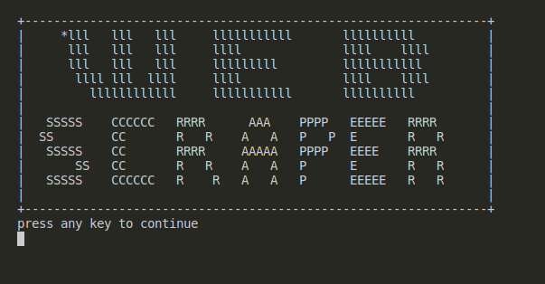
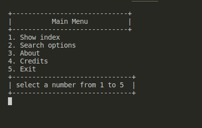
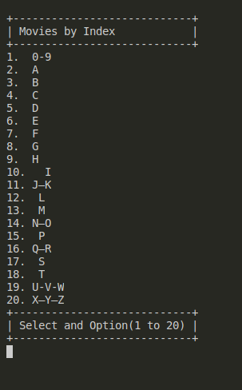
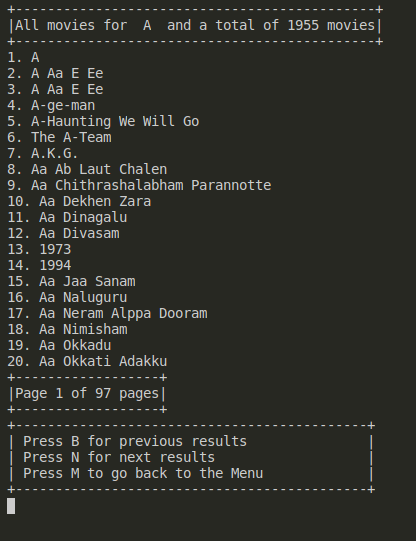
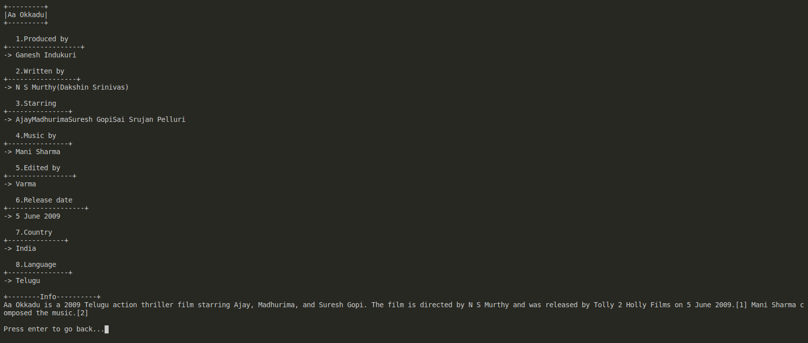
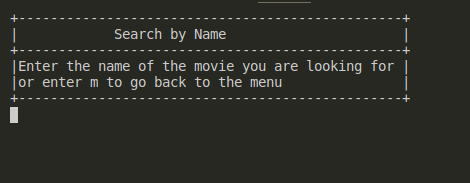
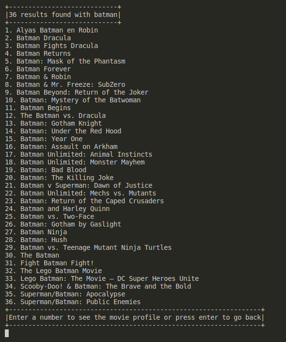

## Ruby's Movies WEB Scraper from wikipedia

> This is a web scraper wich allows you get all movies on wikipedia and get info from each then, also includes a seach by name option wich makes easier to get the basic info from a movie.

## Built With

- >Ruby

## Getting Started

> To get a local copy up and running follow these simple example steps.

### Prerequisites

1. VSCode

2. Terminal (Bash)

3. Linter tests

4. Git

5. Ruby

6. nokogiri

7. httparty

8. Rspec
  
### Setup

>Setup by  following the installation instructions below :
* Open your terminal and locate on the folder you want to clone the repository.

### Install

Run the following command into your terminal:

```console
git clone git@github.com:JAAR91/Web_Scraper_Ruby.git
```
## How to Start the Game

```console
ruby bin/main.rb
```

### Usage

Its simple, once open you find yourself on the welcome page:


Once you press enter you will find the menu screen:


To select the options you need to enter the number that appear next to each option, if choosing 1 this will take you to the index:


Choose any of this option to get a list of movies base on the option selected(Ex. 2):


Now on top you will see the amount of movies on this list, also you can see the list by pages do you dont need to scroll to find a movie, and you can change pages using n(next) or b(back), also you can go backj to menu by pressing m, then to se the movie profile you need to enter the number next to it(Ex. 19):


Now you can see all the basic details of the movie including a brief info about it. To go back just press enter.

When you select the seach option on the menu, you first will have to wait a couple of seconds after the program gets all the movies from the page, then it will ask you to enter the name of the movie, like this:


Enter a word(Ex. batman) and this will returna all the movies that contains that word on their name:


Now you only have to enter the number of the movie you want to see the info off, just like we saw before, if you want to look for another movie just press enter, and it will ask you again to enter a name, to go back to the menu just press m on the seach by name screen.

## Authors

👤 **Jose Alberto Arriaga Ramos**

- GitHub: [@jaarkira](https://github.com/jaarkira )
- Twitter: [@91_jaar](https://twitter.com/91_jaar )
- LinkedIn: [Jose Arriaga](https://www.linkedin.com/in/jose-arriaga-63a851204/)

## 🤝 Contributing

Contributions, issues, and feature requests are welcome!

Feel free to check the [issues page](Feel free to check the [issues page](https://github.com/JAAR91/Web_Scraper_Ruby/issues).

## Show your support

Give a ⭐️ if you like this project!

## Acknowledgments

- Thanks to Microverse and their supportive community.
- Thanks to everyone commiting in this project.

## 📝 License

This project is [MIT](./MIT.md) licensed.
